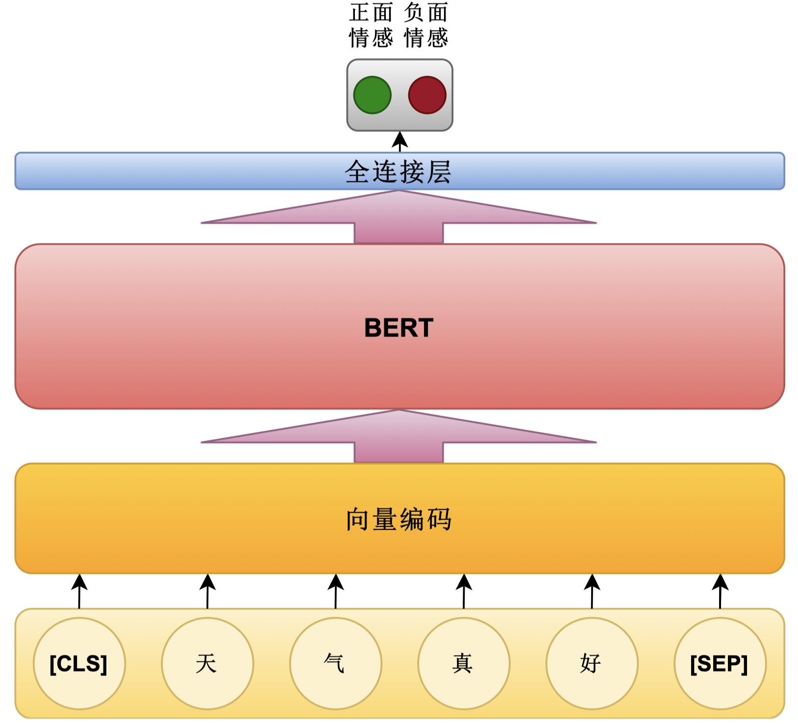
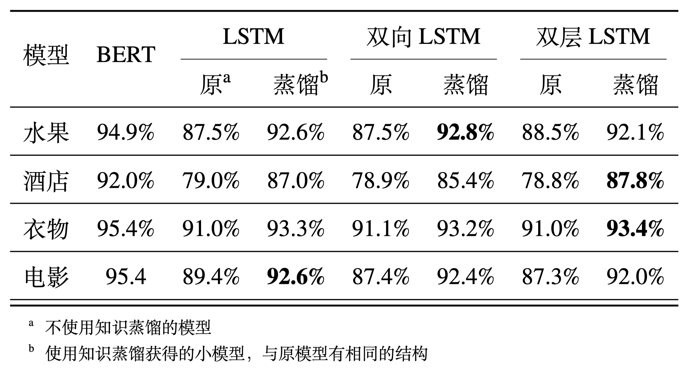

# Knowledge-Distillation-PyTorch

Emotion Classification: Comparing Bert and LSTM

---

参考论文《Distilling Task-Specific Knowledge from BERT into Simple Neural Networks》

### 方法介绍

知识蒸馏框架图：


Teacher 网络使用 Bert 作为核心进行微调和推理



Student 网络使用的其中两种 LSTM 网络 - 左侧是双向 LSTM 网络，右侧是双层 LSTM 网络。


### 使用方法

需要先下载 [word2vec](https://drive.google.com/file/d/1LgdxEJ78Y3BnHPeQLjnwLLVzz_oI760r/view?usp=sharing) 文件到 `/data/cache/` 文件夹下。

1. 首先微调 BERT 模型

   ```
   python bert.py
   ```

2. BERT 作为 Teacher 模型将知识蒸馏到 LSTM Student 模型中

   ```
   python distill.py
   ```

3. 直接训练并测试小模型

   ```
   python small.py
   ```

运行结束后会自动将生成的模型储存在 `/data/cache/` 文件夹中。

### 结果分析和对比

本文对于基于BERT的分类模型（Teacher 模型）和多种 LSTM 选型（Student模型）进行了实验。

实验中LSTM模型使用了单层 LSTM 模型，双向 LSTM 模型，双层 LSTM 模型。

实验评估了 LSTM 子模型单独训练和使用知识蒸馏的方式训练出来的结果。

实验使用的数据集是有标注的对于不同种类商品的评价汉语语料，每类共 10000 条。使用其中 9000 条进行训练，1000 条测试，得到的结果如下表所示。



实验结果显示，蒸馏得到的 LSTM 模型相较于直接训练的模型，经过相同的训练迭代次数，能实现更好的推理准确率。


实验数据显示，知识蒸馏可以显著减小模型的体积，并极大的提高推理任务的速度。

模型体积减小为原来的 3 %，推理速度减少为原来的 1.6 %。

